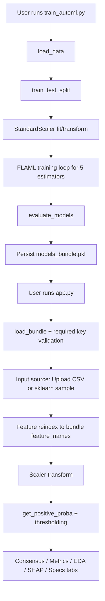

# Breast-Cancer-Classification

Production-oriented binary classification workflow with:
- model training (`train_automl.py`),
- model bundle persistence (`models_bundle.pkl`),
- interactive inference/analysis UI (`app.py`),
- automated test suite (`tests/`).

## Quickstart

```bash
python -m venv venv
venv\Scripts\activate
pip install -r requirements.txt
python train_automl.py
streamlit run app.py
```

`app.py` requires `models_bundle.pkl`. If missing, run `python train_automl.py` first.

---

## 1) Project Overview

This repository implements a binary classification system centered on breast cancer data by default.

What it does (from code):
- Trains five FLAML-based models (`lgbm`, `xgboost`, `rf`, `extra_tree`, `lrl1`) with a shared preprocessing pipeline.
- Saves trained models, scaler, feature names, and metadata into a single bundle file.
- Loads the bundle in a Streamlit app for batch inference, consensus voting, performance visualization, EDA, SHAP explanations, and per-model parameter inspection.

Problem addressed:
- Provide a single flow for training + interactive inference/analysis without manual model wiring in the UI.

---

## 2) Architecture Overview

## Components

| Layer | File | Responsibilities |
|---|---|---|
| UI layer | `app.py` | Load bundle, parse input data, align features, run inference, compute metrics/charts, render Streamlit tabs |
| Backend/training logic | `train_automl.py` | Load dataset, split/scale, train FLAML models, evaluate metrics, persist bundle |
| Tests | `tests/*` | Unit/integration/edge checks for training logic, bundle integrity, inference behavior |

Note: `backend.py` is not present in this repository.

---

## 3) System Flow

## End-to-end execution flow

1. Configure training constants in `train_automl.py` (`DATA_SOURCE`, `TARGET_COLUMN`, `APP_TITLE`, `CLASS_LABELS`, `TIME_BUDGET`).
2. Run training (`python train_automl.py`):
   - load dataset,
   - split train/test,
   - fit `StandardScaler`,
   - train FLAML models,
   - evaluate,
   - write `models_bundle.pkl`.
3. Run UI (`streamlit run app.py`):
   - load and validate bundle,
   - load data (uploaded CSV or sklearn sample),
   - align columns to bundle feature set,
   - scale features,
   - produce predictions/probabilities,
   - render analysis tabs.



---

## 4) Workflow / Agent Logic

No workflow-engine or agent framework is implemented in this codebase.

Implemented control flow is procedural:
- training loop over fixed estimator map in `train_automl.py`,
- UI branch logic via Streamlit controls and conditional blocks in `app.py`.

---

## 5) Data Model / State Structure

## Persisted bundle structure (`models_bundle.pkl`)

| Key | Type | Purpose |
|---|---|---|
| `models` | `dict[str, AutoML]` | Trained FLAML model objects keyed by display name |
| `scaler` | `StandardScaler` | Feature scaling object used during training/inference |
| `feature_names` | `list[str]` | Canonical feature order used to align inference data |
| `metadata` | `dict` | UI/training metadata: `title`, `class_labels`, `target_column` |

## Runtime data objects in `app.py`

| Variable | Type | Purpose |
|---|---|---|
| `df` | `DataFrame` | Raw loaded dataset |
| `labels` | `Series` or `None` | Ground-truth target when available |
| `df_features` | `DataFrame` | Features used for inference after `target` drop/reindex |
| `X_scaled` | `ndarray` | Scaled features fed into models |
| `model_predictions` | `DataFrame` | Per-model class labels for consensus |
| `results_table` | `DataFrame` | Display table with consensus score/diagnosis |

---

## 6) Core Modules Breakdown

## `train_automl.py`

| Function | Input | Output | Behavior |
|---|---|---|---|
| `load_data()` | none (uses config constants) | `DataFrame` | Loads sklearn breast cancer dataset or CSV path from `DATA_SOURCE` |
| `train_flaml_model(x_train, y_train, estimator_name, time_budget)` | scaled features, labels, estimator id, budget | `AutoML` | Runs FLAML with `metric='roc_auc'`, classification task, logs to `logs/flaml_<estimator>.log` |
| `evaluate_models(models, x_test, y_test)` | model dict + test data | `DataFrame` | Computes Accuracy, Recall (pos_label=0), Precision (pos_label=0), F1 (pos_label=0) |
| `main()` | none | none | Full pipeline: load → split → scale → train loop → evaluate → save bundle |

## `app.py`

| Function | Input | Output | Behavior |
|---|---|---|---|
| `load_bundle()` | none | `dict` | Loads `models_bundle.pkl`; validates required keys (`models`, `scaler`, `feature_names`) |
| `compute_pca(x_scaled, labels=None)` | scaled features, optional labels | `(DataFrame, ndarray)` | Computes 2D PCA and optional diagnosis label column |
| `get_positive_proba(model, x)` | model, feature matrix | `ndarray` | Returns class-0 probability, using `predict_proba` or transformed `decision_function` |
| `load_dataframe_from_sklearn()` | none | `DataFrame` | Loads sklearn breast cancer dataset as frame with `target` |
| `load_dataframe_from_upload(uploaded_file)` | uploaded file object | `DataFrame` | Parses CSV and raises `ValueError` on CSV parser/encoding errors |

---

## 7) Security Model

Implemented protections (code-level):
- Bundle existence/load failure handling with user-facing stop conditions.
- Bundle schema check for required keys before UI continues.
- CSV parsing error handling for empty/invalid/encoding cases.
- Feature alignment to trained schema via reindex (`fill_value=0`), plus warnings for missing/extra columns.
- Scaling exceptions are caught and shown to user.

Security constraints not implemented:
- No authentication/authorization.
- No sandboxing for model file loading (pickle/joblib trust boundary remains).
- No network/API access control logic in app code.

---

## 8) LLM / Provider Integration

No LLM provider integration exists in this repository.

---

## 9) Setup & Installation

## Local environment (Windows PowerShell)

```powershell
python -m venv venv
venv\Scripts\Activate.ps1
pip install -r requirements.txt
```

## Training

```bash
python train_automl.py
```

## Docker

```bash
docker compose build
docker compose run --rm classification-lab python train_automl.py
docker compose up
```

---

## 10) Running the Application

Start UI:

```bash
streamlit run app.py
```

What the user sees:
- Sidebar controls for model selection, threshold tuning, data source, and manual single-row prediction.
- Five tabs:
  1. Consensus Diagnosis
  2. Ranking & Performance
  3. Deep EDA
  4. Model Explainability (SHAP)
  5. Model Specs

Expected behavior:
- If `models_bundle.pkl` is missing or invalid, app shows error and stops.
- If uploaded CSV does not parse, app shows error and stops.
- If `target` column is present, performance metrics/ROC/confusion matrix are enabled.

---

## 11) Testing

Framework:
- `pytest` (with `pytest-cov` installed in dependencies).

Run tests:

```bash
python -m pytest tests/ -q
```

Test suite includes:
- training pipeline and metric tests (`tests/test_train_automl.py`),
- utility/inference helper tests (`tests/test_app_utils.py`),
- bundle/pipeline/SHAP tests (`tests/test_ml_pipeline.py`),
- edge-condition tests (`tests/test_edge_cases.py`),
- shared fixtures (`tests/conftest.py`).

---

## 12) Limitations

Code-observable constraints:
- Current UI logic is binary-class oriented (`0` and `1` expected in class labels and confusion matrix).
- `labels = df["target"].astype(int)` assumes integer-convertible target values when `target` exists.
- SHAP path is implemented through `TreeExplainer`; non-tree explainability is not implemented.
- `joblib.load("models_bundle.pkl")` requires trusted model artifacts.
- Training uses module-level constants; no CLI argument parser is implemented.

---

## 13) Future Improvements (Grounded)

Potential improvements directly implied by current code shape:
- Add explicit multiclass handling in UI metrics/plots and probability adapter paths.
- Add CLI arguments or config-file loading for training parameters.
- Add stronger bundle schema/version validation (beyond required keys).
- Extend tests to import real app functions directly instead of copied function bodies.

---

## Project Structure

```text
app.py
train_automl.py
models_bundle.pkl
requirements.txt
Dockerfile
docker-compose.yml
tests/
logs/
```

## License

MIT License
