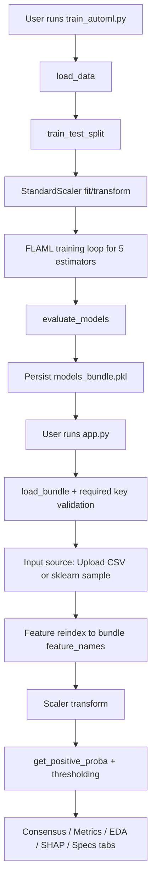

# Breast cancer classification

This repository trains binary breast-cancer classifiers, stores them in a
local Joblib bundle, and presents predictions and analysis in Streamlit. It
contains the training script, dashboard, and test suite.

## Start here

```powershell
uv sync
uv run python train_automl.py
uv run streamlit run app.py
```

The dashboard needs `models_bundle.pkl`. Create it by running the training
command from the repository root.

## Documentation

| Document | When to use it |
|---|---|
| [Architecture and bundle reference](docs/architecture.md) | Learn how training, persistence, and inference fit together |
| [Development and operations guide](docs/development.md) | Set up the project, run checks, use Docker, or troubleshoot the app |
| [Foundation-model runbook](docs/foundation-models.md) | Install or run Mitra v2 and TabFM |
| [ADR 0001: Local foundation models](docs/adr/0001-local-foundation-models.md) | Review the local-model decision and its tradeoffs |
| [Test report](TEST_REPORT.md) | See the latest verified results and known limits |

## Optional foundation classifiers

Mitra v2 and TabFM are optional local research classifiers. The regressor
checkpoints do not apply to this binary target.

```powershell
uv sync --extra foundation
uv run python train_automl.py --foundation-models mitra tabfm --accept-tabfm-noncommercial-license
uv run streamlit run app.py
```

Mitra uses `autogluon/mitra-classifier-2` with `fine_tune=False`. The code uses
CUDA when the installed PyTorch runtime exposes it and retries on CPU after a
CUDA out-of-memory error. TabFM uses its PyTorch classifier on CPU, with four
estimators and at most 100 context rows. This path avoids the JAX/Orbax
checkpoint-allocation failure seen on Windows.

TabFM weights use the `tabfm-non-commercial-v1.0` license and are limited to
noncommercial, nonproduction research. The acceptance flag is required before
the checkpoint download. Mitra code and weights use Apache-2.0. Hugging Face
caches checkpoints; generated AutoGluon files stay in ignored
`model_artifacts/`.

## What the project does

By default, `train_automl.py` loads the scikit-learn breast-cancer dataset. It
splits and scales the data, searches five FLAML estimators, optionally retains
the strongest LazyPredict classifiers, evaluates them, and writes one bundle.
The dashboard reads that bundle for batch predictions, consensus results,
metrics, EDA, SHAP views for compatible models, and model parameters.

| Layer | File | Responsibility |
|---|---|---|
| Dashboard | `app.py` | Loads the bundle, aligns inputs, runs inference, and renders Streamlit views |
| Training | `train_automl.py` | Loads and scales data, trains classifiers, evaluates them, and writes the bundle |
| Foundation adapters | `foundation_models.py` | Lazily exposes Mitra and TabFM through the dashboard model interface |
| Tests | `tests/` | Covers training, bundle integrity, inference, edge cases, and foundation adapters |

`backend.py` is not part of this repository. The application does not use an
agent framework or an LLM provider.

## How data moves through the app

1. Set `DATA_SOURCE`, `TARGET_COLUMN`, `APP_TITLE`, `CLASS_LABELS`, and
   `TIME_BUDGET` in `train_automl.py` when you need a dataset other than the
   built-in sample.
2. Run `uv run python train_automl.py` to load data, split it, fit the scaler,
   train classifiers, evaluate them, and write `models_bundle.pkl`.
3. Run `uv run streamlit run app.py` to load the bundle, read an uploaded CSV
   or sample data, align features, transform values, and show results.


```mermaid
flowchart TD
    A[User runs train_automl.py] --> B[load_data]
    B --> C[train_test_split]
    C --> D[StandardScaler fit/transform]
    D --> E[FLAML training loop for 5 estimators]
    E --> F[evaluate_models]
    F --> G[Persist models_bundle.pkl]
    G --> H[User runs app.py]
    H --> I[load_bundle + required key validation]
    I --> J[Input source: Upload CSV or sklearn sample]
    J --> K[Feature reindex to bundle feature_names]
    K --> L[Scaler transform]
    L --> M[get_positive_proba + thresholding]
    M --> N[Consensus / Metrics / EDA / SHAP / Specs tabs]
```

## Bundle contents

| Key | Type | Purpose |
|---|---|---|
| `models` | `dict[str, classifier]` | Trained classifiers keyed by display name |
| `scaler` | `StandardScaler` | Fitted transformation used during training and inference |
| `feature_names` | `list[str]` | Feature names and their required order |
| `metadata` | `dict` | Title, class labels, target name, model provenance, and research-only state |

`app.py` uses the stored feature order when it receives data. Its main runtime
objects are the raw DataFrame (`df`), optional ground-truth labels (`labels`),
aligned features (`df_features`), scaled values (`X_scaled`), per-model labels
(`model_predictions`), and displayed results (`results_table`).

## Main functions

### `train_automl.py`

| Function | Purpose |
|---|---|
| `load_data()` | Loads the configured scikit-learn dataset or CSV |
| `train_flaml_model(...)` | Runs a FLAML classification search using ROC-AUC and an estimator-specific log file |
| `evaluate_models(...)` | Calculates accuracy, malignant-class recall, precision, and F1 |
| `train_foundation_models(...)` | Downloads pinned checkpoints and prepares requested Mitra or TabFM adapters |
| `main(argv=None)` | Runs training from data loading through bundle persistence |

### `app.py`

| Function | Purpose |
|---|---|
| `load_bundle()` | Loads and validates `models_bundle.pkl` |
| `compute_pca(...)` | Builds the two-dimensional PCA view |
| `get_positive_proba(...)` | Returns class-0 probability from supported classifier interfaces |
| `load_dataframe_from_sklearn()` | Builds the default sample DataFrame |
| `load_dataframe_from_upload(...)` | Parses an uploaded CSV and raises controlled parser errors |

## Security and limits

The dashboard checks bundle keys, handles bundle-load errors, reports CSV parser
errors, warns about missing or extra columns, and reports scaling errors.

It has no authentication, authorization, sandbox for model deserialization, or
network/API access controls. `joblib.load("models_bundle.pkl")` is a trust
boundary; load only artifacts you created or trust.

The UI expects a binary target with classes `0` and `1`. When an input includes
`target`, the code converts it with `df["target"].astype(int)`. Tree SHAP covers
tree-compatible models only. Dataset and FLAML settings remain module-level
constants; the CLI selects optional foundation models and records TabFM license
acceptance.

## Run and test

Install the local environment:

```powershell
uv sync
```

Run the test suite:

```powershell
uv run pytest tests/ -q
```

The suite covers training and metrics, app helpers, bundle and SHAP behavior,
edge conditions, and shared fixtures.

To use Docker for the classical application:

```powershell
docker compose build
docker compose run --rm classification-lab uv run --no-sync python train_automl.py
docker compose up
```

The dashboard includes controls for model selection, threshold tuning, data
source selection, and single-row prediction. Its five tabs cover consensus
diagnosis, ranking and performance, EDA, model explainability, and model specs.

## Possible next steps

- Add multiclass handling to UI metrics, plots, and the probability adapter.
- Add a config file or CLI options for dataset and FLAML settings.
- Add a bundle schema version and stronger compatibility checks.
- Import app functions directly in more tests rather than copying their logic.

## Project layout

```text
app.py
train_automl.py
foundation_models.py
models_bundle.pkl
pyproject.toml
uv.lock
Dockerfile
docker-compose.yml
tests/
logs/
```

## License

MIT License

Created by Ahmad Mujtaba.
