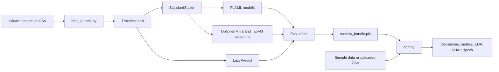

# Architecture and bundle reference

Training writes a bundle that `app.py` uses to run the Streamlit application.
This page defines that handoff and the bundle contract.

## System boundary

The project runs binary classification locally. It has no HTTP API, LLM service,
or application backend for inference. Network access is needed only when uv
installs dependencies or Hugging Face downloads optional checkpoints.

## Training flow

1. `load_data()` reads the built-in scikit-learn breast-cancer dataset or the CSV selected by `DATA_SOURCE`.
2. The pipeline separates `TARGET_COLUMN`, creates a stratified 80/20 split, and fits `StandardScaler` only on the training partition.
3. Five FLAML searches run independently: LightGBM, XGBoost, random forest, extra trees, and L1 logistic regression. Each receives `TIME_BUDGET` seconds.
4. LazyPredict runs on unscaled frames because its pipelines perform their own scaling. The top classifiers are extracted and checked against the bundle scaler before persistence.
5. Requested foundation classifiers are added through `train_foundation_models()`.
6. `evaluate_models()` calculates accuracy, malignant-class recall, precision, and F1. In this dataset, class `0` is malignant.
7. Joblib writes the models, scaler, feature order, and metadata to `models_bundle.pkl`.

Classical model failures are reported and skipped. The pipeline stops if every
FLAML model fails. A requested foundation-model failure stops the run, which
prevents a partial foundation run from looking complete.

## Inference flow

`app.py` loads the bundle once with Streamlit resource caching. It then:

1. loads the built-in dataset or an uploaded CSV;
2. separates an optional `target` column;
3. warns about missing and extra features;
4. reindexes the input to the persisted `feature_names` order, filling missing values with zero;
5. transforms values with the persisted scaler;
6. asks each selected model for class-0 probability;
7. applies the user-selected threshold and calculates consensus output.

The five tabs show consensus diagnosis, model ranking, exploratory analysis,
SHAP explanations, and model parameters. Foundation adapters declare
`supports_tree_shap = False`, so the UI skips `shap.TreeExplainer` for them.

## Bundle contract

The bundle is a trusted local Joblib file with this structure:

| Key | Type | Required | Meaning |
|---|---|---:|---|
| `models` | `dict[str, classifier]` | Yes | Display name mapped to an object that provides `predict`; probability-capable models also provide `predict_proba` or `decision_function` |
| `scaler` | `StandardScaler` | Yes | Fitted training scaler used by the app |
| `feature_names` | `list[str]` | Yes | Canonical feature names and order |
| `metadata` | `dict` | No | UI labels, target name, foundation provenance, and license state |

Current metadata fields:

| Field | Type | Meaning |
|---|---|---|
| `title` | `str` | Streamlit page title |
| `class_labels` | `dict[int, str]` | Human-readable names for classes `0` and `1` |
| `target_column` | `str` | Training target column |
| `foundation_models` | `dict` | Source repository, pinned revision, license, and research-only flag for each requested foundation model |
| `research_only` | `bool` | Enables the TabFM license warning in the app |

Load bundles only from a trusted source. Joblib uses pickle-compatible
deserialization, which can execute code while loading.

## Foundation adapters

`foundation_models.py` gives the optional models the interface used by the app.

- `MitraV2ClassifierAdapter` converts scaled arrays back to named DataFrames and lazily loads the AutoGluon predictor from `model_artifacts/mitra-v2`.
- `TabFMClassifierAdapter` stores the training context in the bundle, lazily restores the pinned PyTorch checkpoint on CPU, and fits the in-context classifier before inference.
- Both adapters fix class order to `[0, 1]` and remove loaded runtimes during serialization.
- `evaluate_models()` calls `release_runtime()` after each foundation evaluation to avoid retaining both large models at once.

## Deployment boundary

The Docker image installs the base dependency set. It trains and serves the
classical bundle. It does not install or run the `foundation` extra. Foundation
checkpoints and AutoGluon artifacts stay local and are excluded from Git and
the Docker build context.

See [ADR 0001](adr/0001-local-foundation-models.md) for the decision and [the foundation-model runbook](foundation-models.md) for commands and limits.
